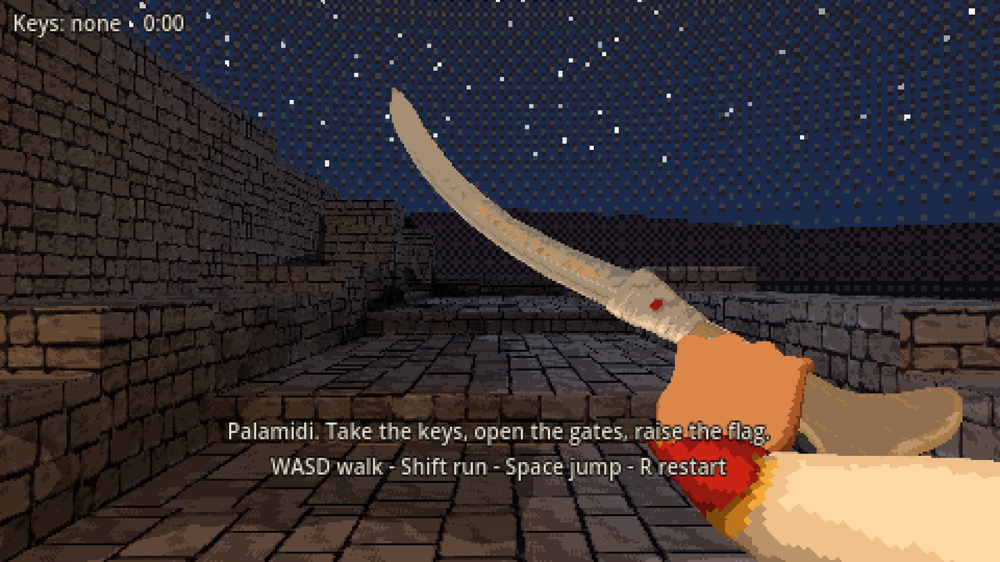

# Games Studio Hub

Original games by George Karagioules: games I design and build, from idle management to cozy puzzles and retro shooters. Each game has its own page with
what it is, how it plays, where it stands and where to play it.

[Games](#the-games) · [GitHub profile](https://github.com/gkaragioul) · [Game preservation and modernization](https://github.com/gkaragioul/game-preservation-hub) · [Software](https://github.com/gkaragioul/gkaragioul/blob/main/SOFTWARE.md)

---

## The games

<table>
<tr>
<td width="50%" valign="top">

<h3><a href="projects/travel-agency-simulator/">Travel Agency Simulator</a></h3>

Out now in Early Access on Steam · Idle-clicker travel-agency management with a 3D office minigame.

</td>
<td width="50%" valign="top">

<h3><a href="projects/perfect-closet/">Perfect Closet: Sort, Style &amp; Decorate</a></h3>

Coming soon to Playgama · Cozy sorting puzzle: clear the closet, dress Mia, decorate six rooms.

</td>
</tr>
<tr>
<td width="50%" valign="top">

<h3><a href="projects/hullwalker/">HULLWALKER</a></h3>

Coming soon to Playgama · Retro sci-fi first-person walker-shooter through five dead decks of a warship.

</td>
<td width="50%" valign="top">

<h3><a href="projects/iron-comet/">IRON COMET: The Last Salvager</a></h3>

In development · Vertical shoot-'em-up for phones where destroyed enemies become orbiting scrap.

</td>
</tr>
<tr>
<td width="50%" valign="top">

<h3><a href="projects/klepht-1821/">Klepht: 1821</a></h3>

Concept stage · Retro first-person game set during the Greek War of Independence.

</td>
<td width="50%" valign="top"></td>
</tr>
</table>

The source code of these games is private. Each project folder holds a plain-language page and screenshots only.

---

All game names, artwork, screenshots and text in this repository © George Karagioules, except Travel Agency
Simulator images and store text © World of Travel. All rights reserved; no licence is granted to reuse them.
