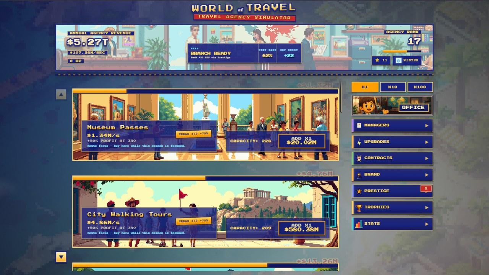
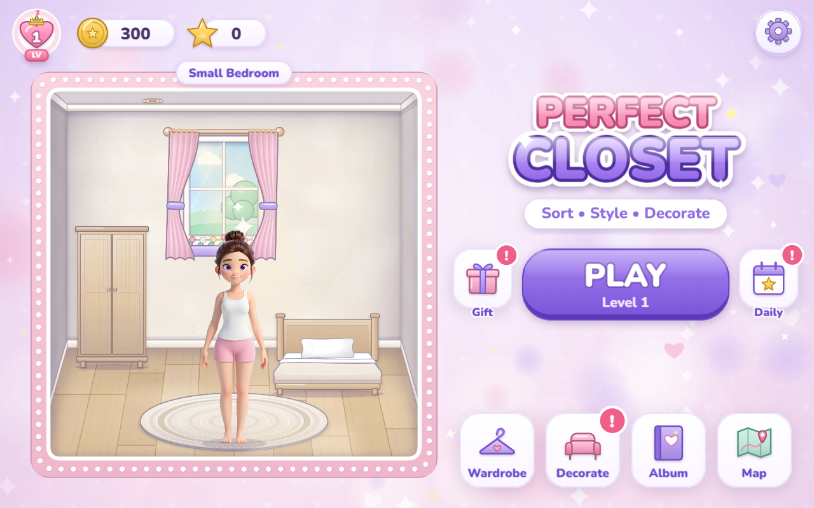
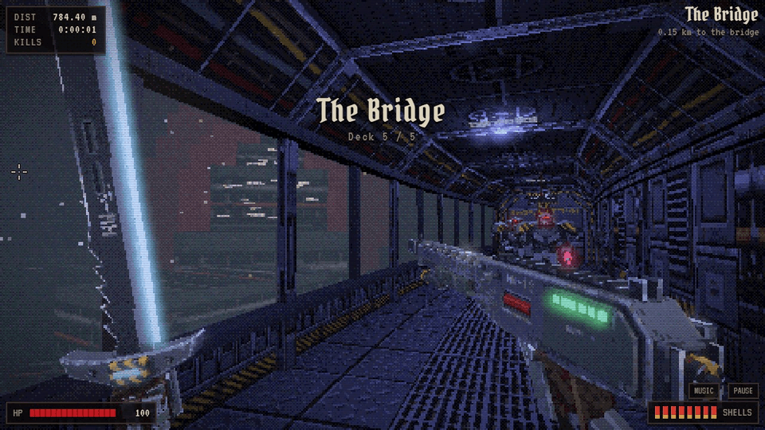
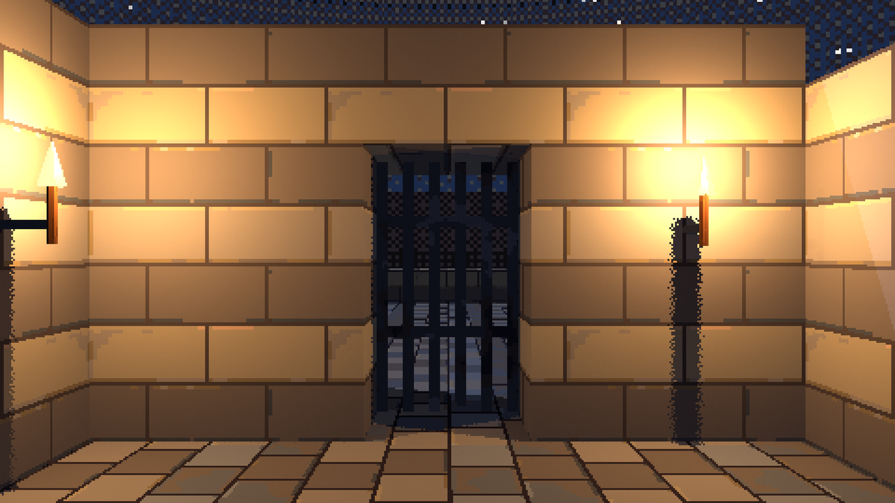
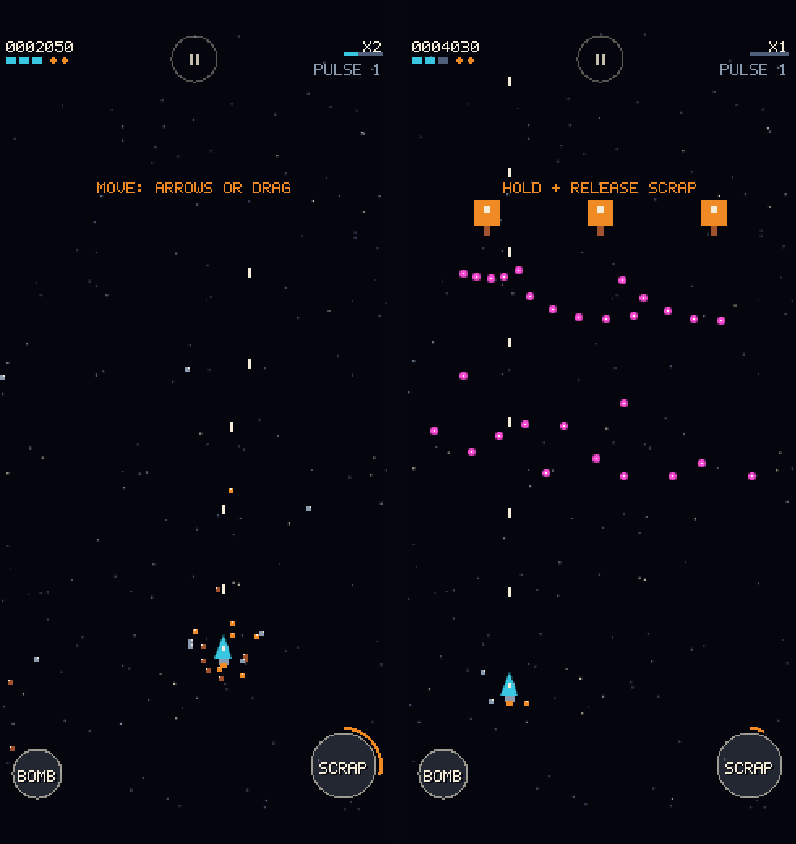

<h1>Games by George Karagioules</h1>

<strong>Original games I design and build: what they are, where they stand and where to play them.</strong> 
<em>The source code of these games is private; this page is the public showcase.</em>

  <a href="#travel-agency-simulator">Travel Agency Simulator</a> &bull;
  <a href="#perfect-closet-sort-style--decorate">Perfect Closet</a> &bull;
  <a href="#hullwalker">HULLWALKER</a> &bull;
  <a href="#klepht-1821">Klepht: 1821</a> &bull;
  <a href="#iron-comet-the-last-salvager">IRON COMET</a>

---

## Travel Agency Simulator

**Out now in Early Access on Steam** (Windows) · Idle / clicker management sim · Published by World of Travel

Build a global travel empire through idle-clicker management, then step inside your agency in an interactive 3D
office minigame. Sell and upgrade travel products, hire managers, automate profits, serve customers, customise your
office and prestige for permanent boosts.

**[View on Steam →](https://store.steampowered.com/app/3169570/Travel_Agency_Simulator/)**

---

## Perfect Closet: Sort, Style & Decorate

**Coming soon to Playgama** (desktop and mobile browsers) · Cozy sorting puzzle · HTML5

Sort fashion items off the closet shelves into a seven-slot tray, three alike clear, then spend the coins and stars
you earn to dress Mia and decorate six rooms. 50 levels across five chapters, each chapter with its own twist.

---

## HULLWALKER

**Coming soon to Playgama** (desktop and mobile browsers) · Retro sci-fi first-person walker-shooter · 3D

The last marine walks alone through five dead decks of a warship toward the bridge. Ambushes seal the doors until
every Husk and Warden is down; a hand-worked shotgun and a stock bash that shoves enemies and parries plasma bolts
are all you have. Retro pixel-3D look, playable with one thumb on a phone.

---

## Klepht: 1821

**Concept stage** · Retro first-person game · Godot

A retro first-person game set during the Greek War of Independence. The first map, Palamidi, and the weapons are the
current focus. Early in-engine shots:

 

---

## IRON COMET: The Last Salvager

**In development (early greybox build)** · Retro 16-bit vertical shoot-'em-up for phones held upright · HTML5

Destroyed enemies become physical scrap that orbits your ship: it blocks bullets, fills the Salvage Meter and fires
back as a Scrap Burst. Twelve stages are planned; a polished first stage comes first.

---

More of my work: [GitHub profile](https://github.com/gkaragioul) ·
[Game preservation and modernization](https://github.com/gkaragioul/gkaragioul/blob/main/GAMES.md) ·
[Software and tools](https://github.com/gkaragioul/gkaragioul/blob/main/SOFTWARE.md)

All game names, artwork, screenshots and text on this page © George Karagioules, except Travel Agency Simulator
images and store text © World of Travel. All rights reserved; no licence is granted to reuse them.

