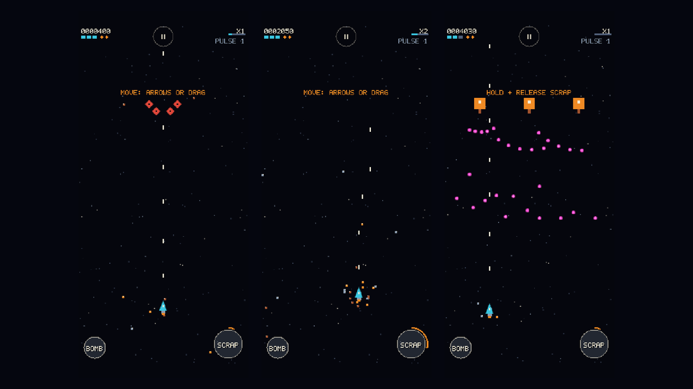

# IRON COMET: The Last Salvager

**Status:** in development (early greybox build). **Genre:** retro 16-bit vertical shoot-'em-up for phones held upright.

*Captured from the current build. Greybox means the shapes, controls and rules are in, while the final art is not
yet.*

## What is this game?

A vertical shoot-'em-up built for a phone held upright. Its twist is scrap: destroyed enemies do not just disappear,
they become physical pieces of scrap that orbit your ship.

## How does it play?

- **Scrap is your shield:** orbiting scrap blocks enemy bullets.
- **Scrap is your meter:** collecting it fills the Salvage Meter.
- **Scrap is your weapon:** hold and release to fire it back as a Scrap Burst.
- **Built for one hand:** drag to move on a phone, or use the arrow keys on a computer.

## Where does it stand?

The greybox of the first stage is playable: movement, shooting, enemies, scrap, the Salvage Meter, the bomb and the
results screen all work. It is now being checked for feel before the art goes in.

## What comes next?

Twelve stages are planned. The first stage comes first and gets finished to final quality, with 16-bit style art,
music and sound, before the rest are built.

## What is public here?

This folder is a plain-language project page with screenshots. The game's source code is private.

[← Games Studio Hub](../../README.md)
