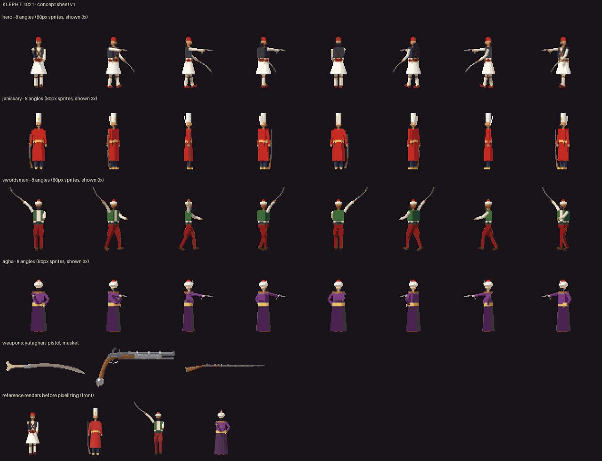
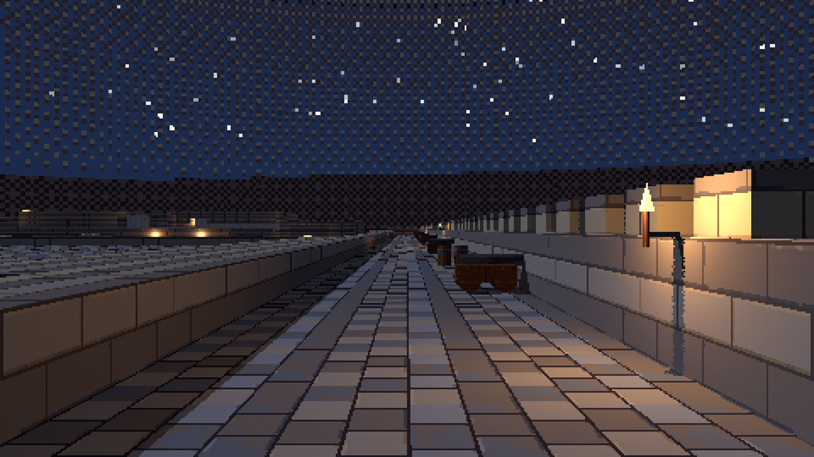

# Klepht: 1821

**Status:** concept stage. **Genre:** retro first-person game. **Engine:** Godot.

*Early in-engine shot. Everything shown is work in progress.*

## What is this game?

A retro first-person game set during the Greek War of Independence of 1821. You play a klepht, one of the mountain
fighters who rose against Ottoman rule, armed with a yataghan, a flintlock pistol and a musket.

The first map is Palamidi, the great fortress above Nafplio, taken by Greek fighters in 1822. The idea is to walk its
walls at night, take the keys, open the gates and raise the flag.

## Where does it stand?

The game is at concept stage. The concept art is done, the three weapons have been designed, and a first version of
the Palamidi fortress can be walked in the engine: gates, ramparts, the chapel and the courtyards.

 

## What comes next?

Finish the Palamidi map and the three weapons, then build the first playable mission around them.

## What is public here?

This folder is a plain-language project page with concept art and in-engine shots. The game's source code is private.

[← Games Studio Hub](../../README.md)
