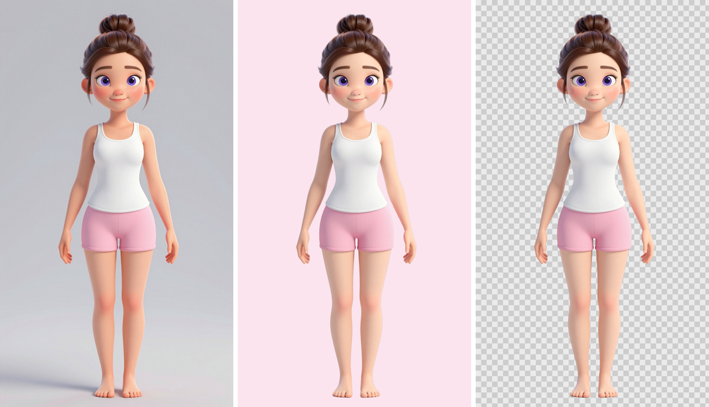

# Perfect Closet: Sort, Style & Decorate

**Status:** complete and in final review; coming soon to Playgama (desktop and mobile browsers). **Genre:** cozy sorting puzzle.

## What is this game?

A cozy puzzle game about a closet that needs sorting. Fashion items sit on the closet shelves; you tap them into a
seven-slot tray, and three matching items clear. Clear the closet to finish a level, earn coins and stars, and spend
them on the fun part: dressing Mia and decorating her home.

## How does it play?

- **50 levels across five chapters.** Each chapter adds its own twist, so the sorting keeps changing as you go.
- **Dress Mia** from a wardrobe of more than a hundred items: tops, bottoms, dresses, shoes and accessories.
- **Decorate six rooms** with around ninety pieces of furniture.
- **Short, relaxed sessions** that suit a phone, with a difficulty rhythm that gives you a breather after every
  harder level.

## Where does it stand?

The full game is built: all levels, the economy, the wardrobe and the rooms. The Playgama build is packaged and
waiting for its final review before release. A painted version of Mia with gentle animation is being tested for the
home screen.

## What comes next?

Release on Playgama, then new wardrobe items for the painted Mia.

## What is public here?

This folder is a plain-language project page with screenshots. The game's source code is private.

[← Games Studio Hub](../../README.md)
