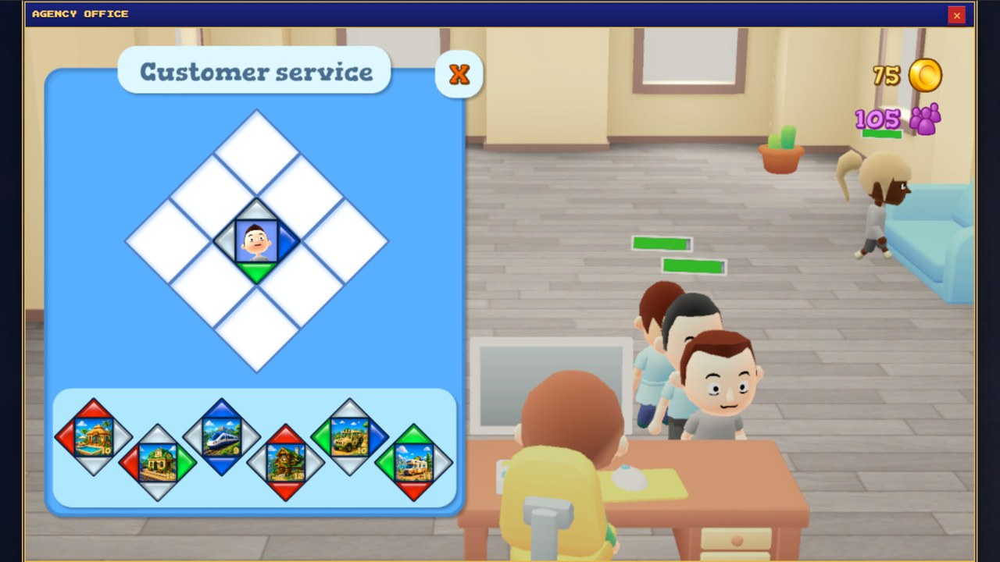
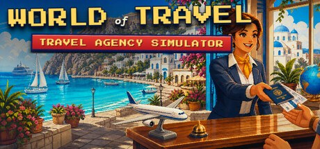

# Travel Agency Simulator

**Status:** out now in Early Access on Steam (Windows), released 24 September 2026. **Publisher:** World of Travel.

*Screenshot from the Steam store page. Images and store text © World of Travel.*

## What is this game?

An idle-clicker management game about building a travel agency into a global travel empire. You start with a single
desk and a basic city tour, serve travellers and reinvest every sale. Over time you unlock museum passes, hotels,
cruises, transfers, resorts and landmark experiences, and each one becomes a revenue stream you can upgrade and
automate.

Between the numbers there is a second game: you can step inside your agency in an interactive 3D office, serve
customers face to face and customise the space. Rewards from the office feed straight back into the main economy.

## How does it play?

- **Click, upgrade, automate:** sell travel products, improve their speed, capacity and income, buy upgrades in bulk
  and hire managers so the money keeps flowing while you are away.
- **Prestige:** reset a branch to earn Reputation and unlock permanent boosts, then rebuild faster than before.
- **The Agency Office:** a 3D office minigame where you serve customers and decorate your agency.
- **Offline earnings, contracts, achievements and events** keep a session worth coming back to.

## Where does it stand?

The game is in Early Access on Steam: the full game loop is playable now, and it is still being developed.

## Where can I play it?

**[View Travel Agency Simulator on Steam →](https://store.steampowered.com/app/3169570/Travel_Agency_Simulator/)**

## What is public here?

This folder is a plain-language project page with store images. The game's source code is private.

[← Games Studio Hub](../../README.md)
